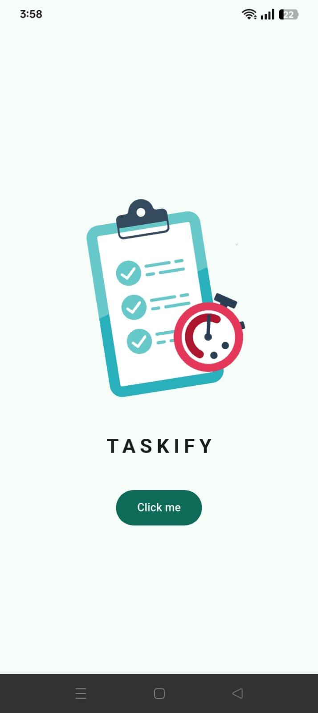
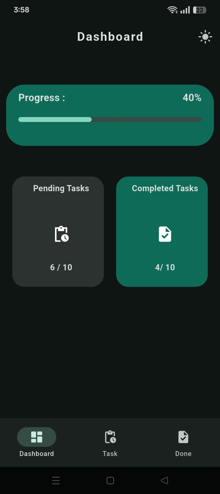
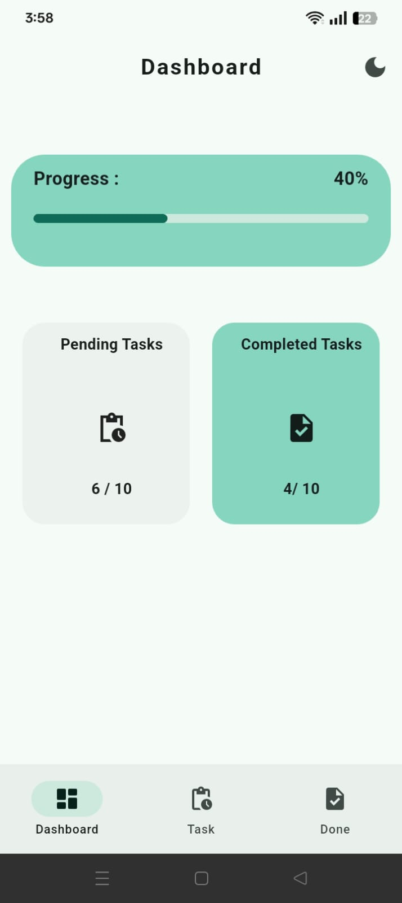
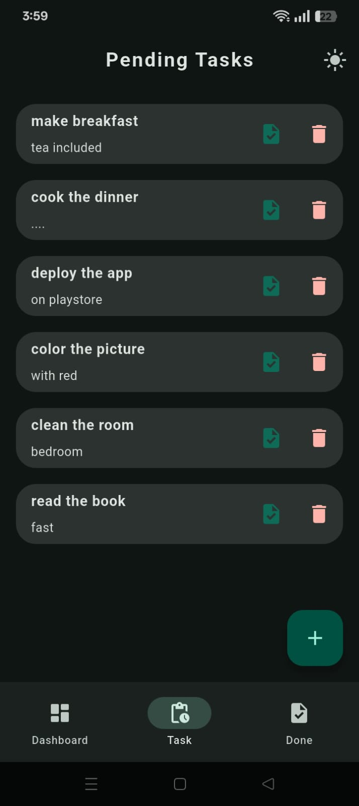
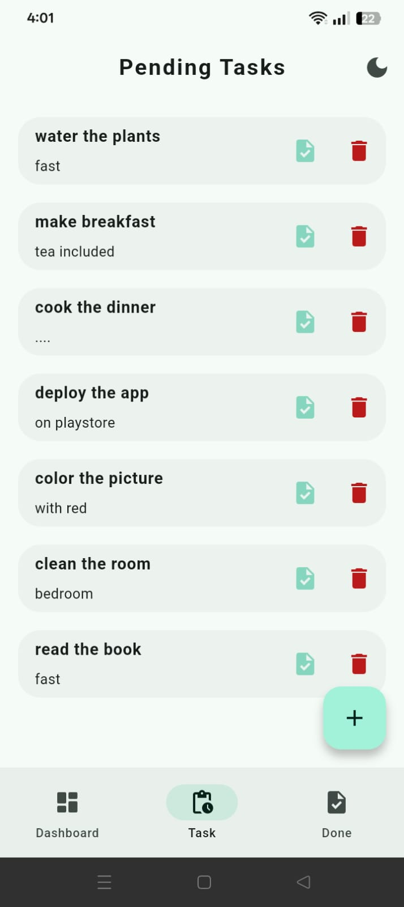
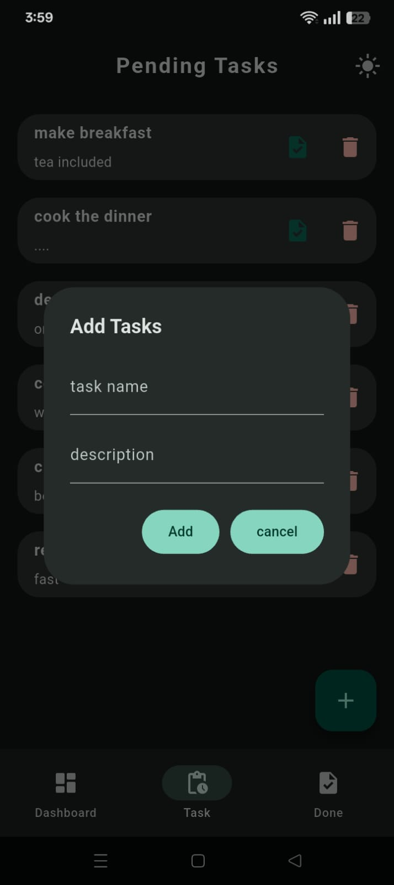
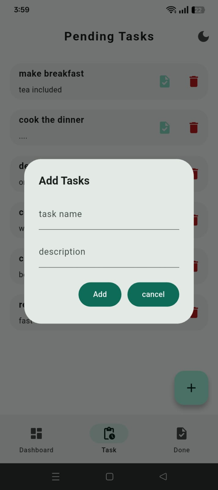
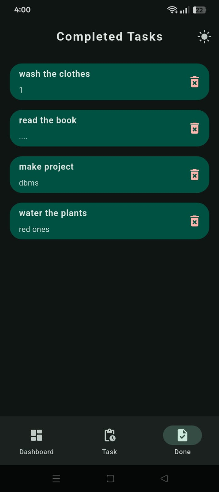
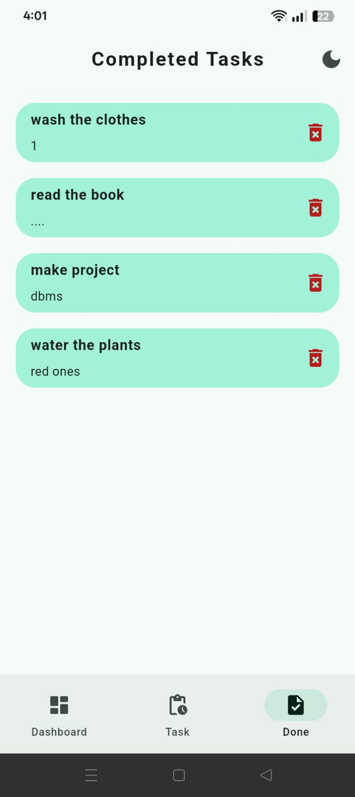
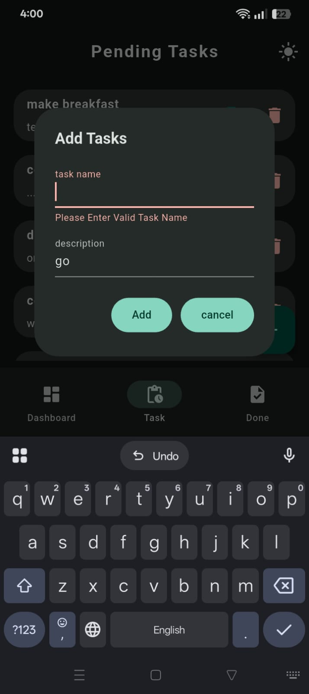

#  Taskify: The Intuitive Flutter Todo Manager

[](LICENSE)
[](https://flutter.dev)
[](https://pub.dev/packages/hive)
[](https://github.com/mujtaba823/Taskify)

---

##  Overview

**Taskify** is a modern, cross-platform todo list application built with **Flutter** that focuses on simplicity, speed, and seamless persistence. It utilizes the powerful **Hive NoSQL database** for fast, local data storage, ensuring your tasks are always available offline. 

The app features dynamic theme switching (Dark Mode by default) and a clear, three-page navigation structure to manage pending, completed, and overall task progress via a visual Dashboard.

##  Key Features

* **Local Persistence:** Uses **Hive** database for fast, reliable, and entirely offline data storage.
* **Dynamic Theming:** Seamless one-tap switching between **Dark Mode** (default) and **Light Mode**.
* **Progress Dashboard:** Tracks and visualizes overall task completion percentage and pending vs. completed counts.
* **Task Management Flow:** Easy addition of new tasks (Title and Description) with direct persistence and input validation.
* **Task Progression:** Mark pending tasks as complete with a single tap, moving them from the pending list (`todoBox`) to the completed list (`completeBox`).
* **Animated Splash Screen:** Engaging loading screen using **Lottie** animations during app initialization.

##  Screenshots & Demo

hese screenshots showcase every major screen, theme state, and interaction within **Taskify**.


| Feature | Dark Mode View | Light Mode View |
| :--- | :---: | :---: |
| **Welcome Screen** |  | N/A |
| **Dashboard** |  |  |
| **Pending Tasks** |  |  |
| **Add Task Dialog** | **** |  |
| **Completed Tasks** |  |  |
| **Error Handling** |  | N/A |

>  **Watch the Demo Video:** [View App Demo on YouTube](https://youtube.com/shorts/fyUo7yd8qCk)


---

##  Getting Started

These instructions will get you a copy of the project up and running on your local machine for development and testing purposes.

### Prerequisites

You need to have Flutter installed and configured on your system.

* **Flutter SDK:** [https://flutter.dev/docs/get-started/install](https://flutter.dev/docs/get-started/install)

### Installation

1.  **Clone the repository:**
    ```bash
    git clone [https://github.com/mujtaba823/Taskify.git](https://github.com/mujtaba823/Taskify.git)
    cd Taskify
    ```
2.  **Install dependencies:**
    ```bash
    flutter pub get
    ```
3.  **Run the code generator** (required for Hive database setup):
    ```bash
    flutter pub run build_runner build
    ```
4.  **Run the app:**
    ```bash
    flutter run
    ```

---

##  Project Structure & Technology Stack

The project uses a clean, component-based structure, leveraging **Hive** for persistence and **ValueNotifier** for lightweight global state management.

### Core Technologies

| Technology | Purpose |
| :--- | :--- |
| **Flutter** | Cross-platform UI Framework |
| **Hive** | Local NoSQL Database for persistence |
| **ValueNotifier** | Simple global state management for theme and navigation index |
| **Lottie** | Animated splash screen assets |

### Key Files (Directory: `lib/`)

| File/Folder | Purpose |
| :--- | :--- |
| `main.dart` | Application entry point; initializes theme listening and runs the app. |
| `data/notiflier.dart` | **State:** Defines global `ValueNotifier` objects (`onDarkmode`, `selectedPageNotifier`). |
| `data/boxes.dart` | **Data Access:** Defines global Hive boxes (`todoBox`, `completeBox`). |
| `views/pages/welcome_page.dart` | **Initialization:** Handles Hive initialization and displays the Lottie splash screen. |
| `views/pages/widget_tree.dart` | **Main Container:** Manages navigation and theme toggling. |
| `views/pages/dashboardpage.dart` | **Dashboard:** Calculates and displays task progress statistics. |
| `views/pages/tasks.dart` | **Pending Tasks:** Displays the task list and handles task creation. |
| `views/pages/completepage.dart` | **Completed Tasks:** Displays the list of finished tasks. |
| `views/todo.dart` | **Data Model:** The Hive-annotated structure for a single `Todo` item. |

---

##  Contributing

Contributions are what make the open-source community such an amazing place to learn, inspire, and create. Any contributions you make are **greatly appreciated**.

1.  Fork the Project.
2.  Create your Feature Branch (`git checkout -b feature/AmazingFeature`).
3.  Commit your Changes (`git commit -m 'Add some AmazingFeature'`).
4.  Push to the Branch (`git push origin feature/AmazingFeature`).
5.  Open a Pull Request.

---

##  License

Distributed under the MIT License. See the `LICENSE` file in the repository root for more information.

---

## 📧 Contact

**[Syed Mujtaba Ali]** - [syedmujtaba826@gmail.com]

Project Link: [https://github.com/mujtaba823/Taskify](https://github.com/mujtaba823/Taskify)
